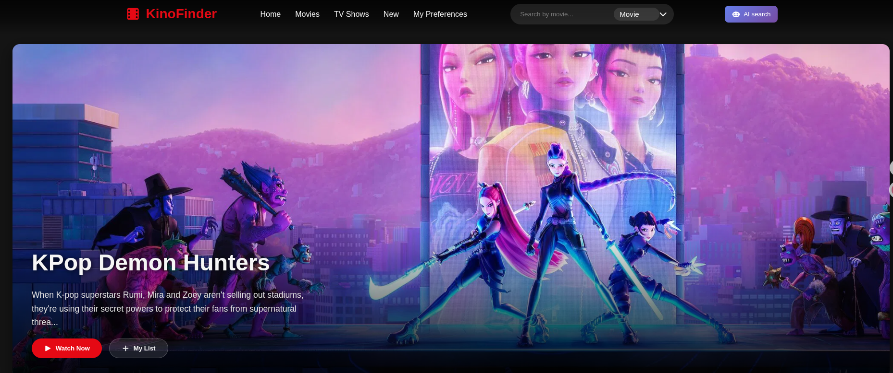
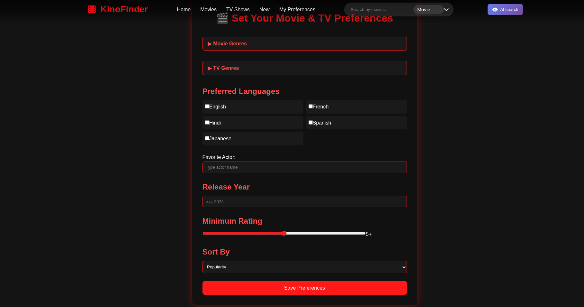
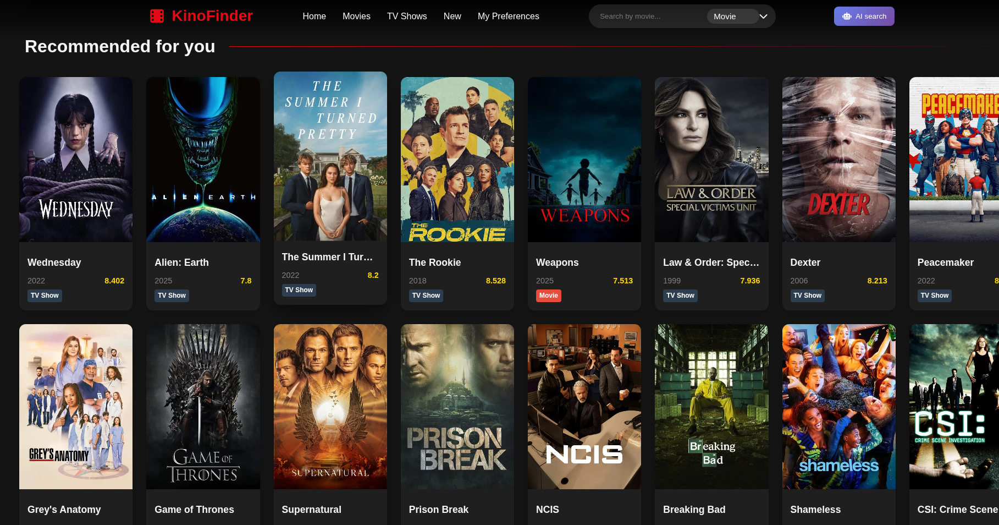

Awesome! Here's a polished, GitHub-ready README for **Kinofinder** with badges, modern style, and all essential info:

---

# Kinofinder 🎬

  

**Kinofinder** is a modern movie and TV show recommendation web app built with **React** and the **TMDb API**. Users can set personalized preferences—genres, languages, favorite actors, year, and rating—to get curated recommendations for both movies and TV shows.



---

## 🌟 Features

* Select preferred **movie & TV genres**
* Choose **languages** for recommendations
* Set a **favorite actor** (TMDb search automatically converts to ID)
* Filter by **release year** and **minimum rating**
* Sort results by popularity, rating, or release date
* **Movies and TV shows** displayed in a unified grid with type badges
* Preferences are saved locally (`localStorage`) under **Kinofinder\_preferences**

---

## 🛠 Tech Stack

* **Frontend:** React, CSS
* **API:** TMDb (The Movie Database)
* **State Management:** React Hooks (`useState`, `useEffect`)
* **Storage:** `localStorage` (namespaced to avoid conflicts)

---

## 🚀 Setup

1. Clone the repository:

```bash
git clone https://github.com/yourusername/kinofinder.git
cd kinofinder
```

2. Install dependencies:

```bash
npm install
```

3. Add your TMDb API key:

   * Replace `YOUR_TMDB_API_KEY` in `Preferences.jsx` and `Recommended.jsx`

4. Start the development server:

```bash
npm run dev
```

Open `http://localhost:5173` in your browser.

---

## 📌 Usage

1. Go to the **Preferences** page.
2. Select genres, languages, enter your favorite actor, set year, rating, and sort order.
3. Click **Save Preferences**.
4. Go to the **Recommended** page to see curated movies and TV shows.

---

## 🖼 Screenshots

**Preferences Page**


**Recommendations Page**


---

## ⚙️ Notes

* Actor filtering requires **TMDb person ID**, automatically handled by the app.
* If no results match all preferences, the app **loosens filters progressively** to ensure recommendations are shown.

---

## 📄 License

MIT License © 2025

---
